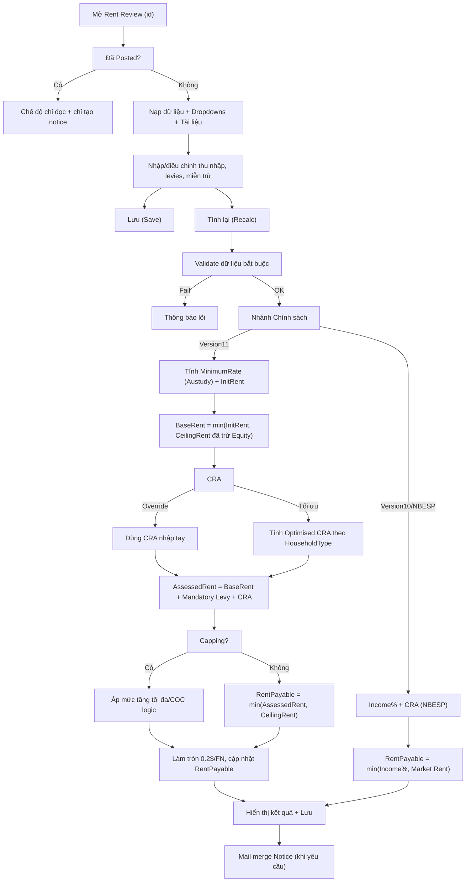
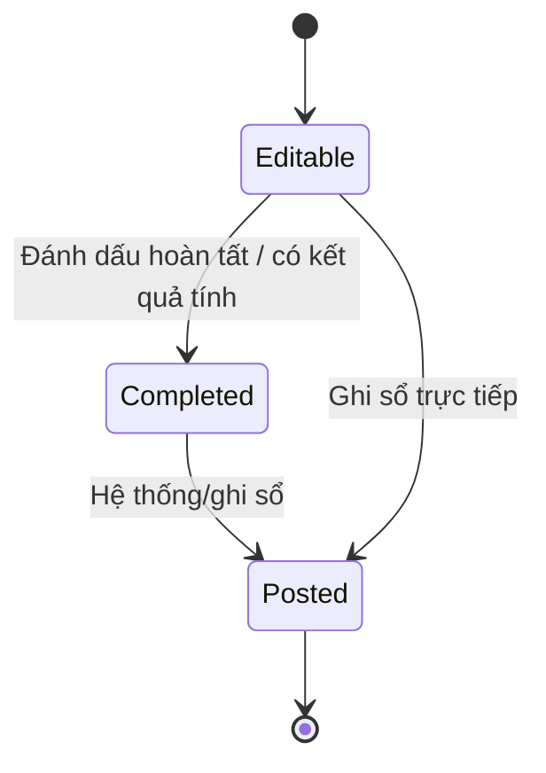
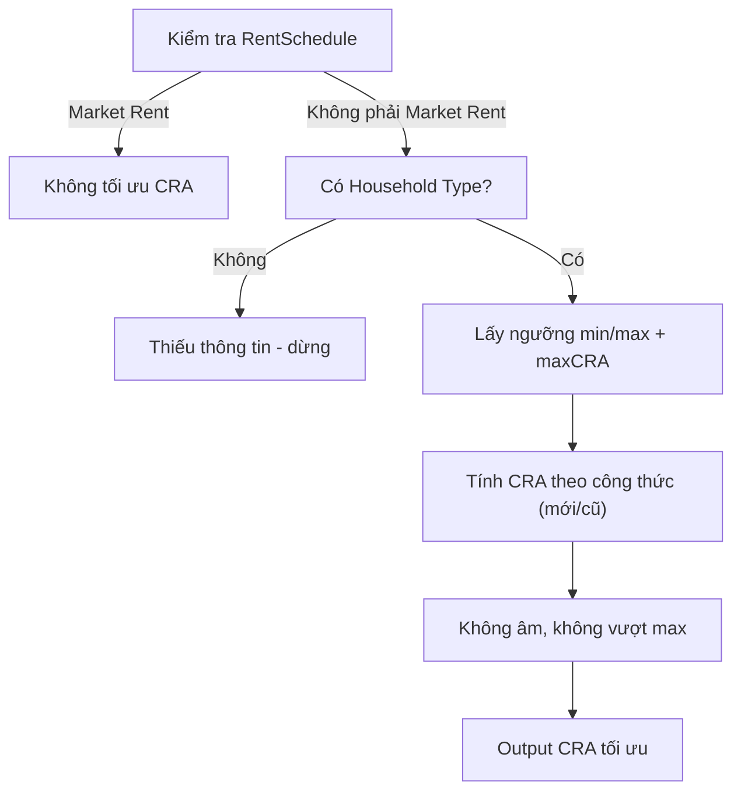
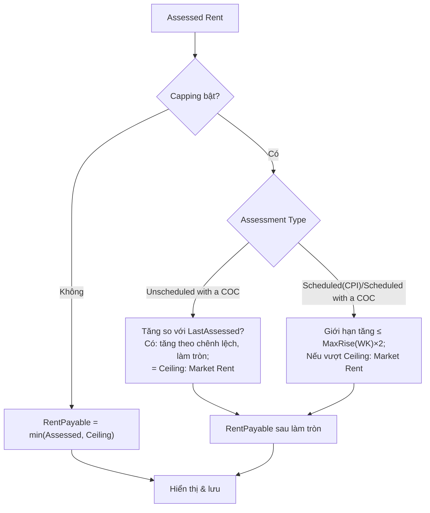

### Tài liệu nghiệp vụ: RentReviewDetails.aspx.cs

- **Mục đích**: Màn hình “Rent Review” dùng để nhập liệu, tính toán và quản lý tiền thuê của một hộ thuê nhà theo chính sách nhà ở cộng đồng. Hỗ trợ tối ưu CRA, áp dụng capping, quản lý levies và phát hành thông báo (notice).

- **Phạm vi dữ liệu**:
  - **Tenant/Property**: thông tin người thuê, partner, địa chỉ, số tenancy, equity, market rent.
  - **Thu nhập tính vào rent (assessable)**: Employment, Pension, Investment, Super, Family Tax A/B, Child Maintenance, Dependant Deduction (18-20), GOM, Other Assessable Income.
  - **Thu nhập không tính (non-assessable)**: một số khoản trợ cấp như GST, Govt Pharm, Mobility/Career allowance, Pension Education Supplement, NonAss Energy Supp, Govt Guardian.
  - **Service Levies**: Mandatory và Voluntary.
  - **Chính sách**: Version11, Version10/NBESP (ảnh hưởng cách tính phần trăm thu nhập và CRA).

### Luồng nghiệp vụ chính

1) Mở màn hình theo `RentReviewID`
   - Nếu review đã posted: chuyển sang chế độ chỉ đọc (chỉ tạo notice).
   - Nạp dữ liệu: tenant, property, household type, policy, ngày hiệu lực, thu nhập, levies, non-assessable, kết quả trước đó.

2) Nhập liệu/CRUD các thành phần
   - Other Assessable Income: xem/Thêm/Sửa/Xóa, tự tổng vào trường tổng để tính.
   - Other Non-Assessable Income: tương tự, chỉ hiển thị tổng (không cộng vào assessable).
   - Service Levies: quản lý các levy của review; tách mandatory/voluntary; cập nhật tổng và hiển thị theo tuần/fortnight.

3) Lưu (Save)
   - Lưu POI, capping, household/assessment type, policy, ngày effective/completed, các khoản thu nhập/levies, ghi chú, CRA (nếu override). Với Version10 có thể override Rent Payable.

4) Tính lại (Recalc)
   - Kiểm tra hợp lệ: chưa posted, có ngày hiệu lực, đã chọn household/assessment type, lý do cho override minimum income/CRA, khoảng cách review cho Scheduled (CPI), điều kiện hardship.
   - Chọn nhánh theo Policy:
     - Version11:
       - Minimum Rate: theo “Austudy” (hoặc override nếu bật). Tính Initial Rent từ tổng thu nhập có trọng số.
       - Ceiling Rent: Market Rent/tenancy, điều chỉnh theo Equity.
       - BaseRent = min(Initial Rent, Ceiling Rent).
       - CRA: dùng giá trị nhập tay nếu override; nếu không, tính “Optimised CRA” theo Household Type và ngưỡng min/max.
       - Assessed Rent = BaseRent + Mandatory Levy + CRA.
       - Capping: nếu đang áp dụng, giới hạn tăng theo cấu hình và logic theo Assessment Type; làm tròn 0.2$/FN (10c/week).
       - Nếu không có POI: dùng Market Rent (coi như “Market Rent”).
     - Version10/NBESP:
       - Tổng thu nhập nhân một tỷ lệ phần trăm thống nhất (NBESPIncomePercentage).
       - CRA theo “Rent Assistance”: 75% phần vượt min đến max CRA.
       - Rent Payable = min(Income% + CRA, Market Rent).

5) Hiển thị kết quả và Notice
   - Hiển thị Base/Assessed/Rent Payable, tăng/giảm, levy, tổng phải trả theo tuần/fortnight.
   - Phát hành notice bằng mail merge theo template của policy; cập nhật `NoticeGeneratedDate`.

### Quy tắc & công thức trọng yếu

- **Base Charge** và điều kiện trần: `(Base Charge - Levies + CRA) <= Market Rent` (tham chiếu comment trong mã nguồn). Ở V11, BaseRent = min(InitialRent, CeilingRent); Assessed = BaseRent + Mandatory Levy + CRA.
- **Assessable Income (V11)**:
  - Employment/Investment/Super/Pension: nhân `RentSchedulePecentage` (tỷ lệ theo rent schedule).
  - FTB A/B, Child Maintenance, Dependant Deduction, GOM: nhân phần trăm cấu hình (theo constants).
  - Other Assessable: cộng thẳng và nhân `RentSchedulePecentage`.
  - Kết quả “SumAssessableIncomeWeighted” là cơ sở cho Initial Rent (FN/WK).
- **Minimum Rate**: theo “Austudy” minThreshold tùy Household Type; có thể override khi bật “IsMinimumIncomeOverride” và chọn lý do.
- **Moderate Rent (nếu áp dụng)**: nếu không thuộc diện miễn trừ theo pension type và tổng thu nhập vượt ngưỡng ModerateRentThreshold x2, dùng tỷ lệ ModerateRentAssessmentRate thay 25%.
- **Ceiling Rent**: Market Rent chia số tenancy, sau đó giảm theo Equity: Ceiling = (100% - Equity)% x Market/tenancy.
- **CRA**:
  - Không tối ưu được nếu đang “Market Rent”.
  - Tối ưu theo min/max threshold và max CRA (công thức cũ: lấy min của 3 phương pháp; công thức mới bật qua `UseNewCRACalculation`).
- **Capping**:
  - Giới hạn tăng theo tuần `MaxRentRisePerWeekNewMethod` (FN = x2).
  - Logic chi tiết theo Assessment Type (Unscheduled with a COC, Scheduled with a COC, Scheduled (CPI)).
- **Làm tròn**: 0.2$/FN (tương đương 10c/week).

### Tác vụ trên giao diện

- Chọn Household Type, Assessment Type, Policy; nhập ngày hiệu lực/hoàn tất.
- Đánh dấu POI/capping/hardship; nhập/cập nhật các khoản thu nhập, miễn trừ, service levies.
- Chọn override Minimum Income/CRA (bắt buộc lý do); nhấn Recalc để tính và Save để lưu; tạo Notice khi cần.

### Bản đồ UI → Trường dữ liệu (mapping nhanh)

- Tenant/Partner POI, Capping: ảnh hưởng quyền chọn schedule và capping khi tính.
- Household Type (`ddlHouseholdType`): quyết định Minimum Rate (Austudy), CRA thresholds, Moderate Rent thresholds.
- Assessment Type (`ddlAssessmentType`): ràng buộc ngày hiệu lực và logic capping (COC/CPI).
- Policy (`ddlPolicy`): chọn nhánh tính V11 hay V10/NBESP.
- Ngày Effective/Completed/Posted/Notice: điều khiển trạng thái và quyền chỉnh sửa.
- Thu nhập assessable: Employment/Super/Investment/Pension, Family Tax A/B, Child Maintenance, Dependant Deduction, GOM, Other Assessable.
- Thu nhập non-assessable: GST, Govt Pharm, Mobility/Career, Pension Education Supplement, NonAss Energy Supp, Govt Guardian (chỉ hiển thị tổng, không cộng vào assessable).
- Service Levies: Mandatory (tính vào Assessed) và Voluntary (chỉ cộng vào tổng thanh toán).
- CRA: tối ưu hoặc override (bắt buộc lý do nếu override).
- Equity/Market Rent/NumberOfTenancies: xác định Ceiling Rent.

### Khác biệt chính sách

- **Version11**:
  - Trọng số theo `RentSchedulePecentage`; Minimum Rate theo Austudy; CRA tối ưu; capping theo loại assessment; tính Base/Assessed chi tiết.
- **Version10/NBESP**:
  - Một tỷ lệ phần trăm thu nhập thống nhất; CRA theo Rent Assistance (75% phần vượt min); có thể override Rent Payable.

### Kiến trúc & phụ thuộc (tổng quan)

- Xử lý dữ liệu (đọc/ghi): `RentCalculationProcessing`, `RentProcessing`, `PropertyDetailsProcessing`, `TenantInfoProcessing`.
- Danh mục/constant: `CentreLinkHouseHoldTypesProcessing`, `PensionTypesProcessing`, `TextConstantProcessing`, `ModerateRentThresholdProcessing`, `ModerateRentAssessmentRateProcessing`, `BusinessRules`.
- Thu nhập/levies: `RentReviewOtherIncomeProcessing`, `OtherExemptionsProcessing`, `TenantServicePaymentsRentReviewProcessing`.
- Tài liệu: `DocumentProcessing`.
- Sự kiện/nhật ký: `EventProcessing`.
- Mail merge notice: `BusinessRules.DoMailMergeRentNotice(v10/v11)`.

### Sơ đồ luồng (Mermaid)

### Trạng thái & quyền chỉnh sửa

- **Editable**: khi review chưa `Posted`.
- **Completed**: khi set `RentCalcCompleted` (V10 có thể đánh dấu hoàn tất sau override; V11 sau Recalc/Save).
- **Posted**: khoá hầu hết thao tác (read-only), chỉ cho phép tạo notice và xem dữ liệu.
- **NoticeGeneratedDate**: cập nhật khi xuất notice.

### Thuật ngữ nhanh

- **CRA**: Commonwealth Rent Assistance (trợ cấp tiền thuê).
- **BaseRent/Base Charge**: Tiền thuê cơ sở từ thu nhập, trước khi cộng CRA; bị chặn bởi trần (Ceiling).
- **Market/Ceiling Rent**: Mức trần tiền thuê trên thị trường (đã chia tenancy và trừ Equity).
- **Assessed Rent**: Base + Mandatory Levy + CRA.
- **Rent Payable**: Số tiền phải trả sau capping và làm tròn.
- **Rent Allowance**: Chênh lệch khi có capping (áp dụng khi đang capping).
- **Capping**: Giới hạn mức tăng theo kỳ.
- **Levies**: Mandatory (bắt buộc) và Voluntary (tự nguyện).
- **POI**: Proof of Income (chứng từ thu nhập).
 
### Ví dụ minh hoạ (đơn giản hoá, đơn vị theo Fortnight - FN)

- **Giả định chung**:
  - Market Rent = 900$/FN; Number of Tenancies = 1; Equity = 10% ⇒ CeilingRent ≈ 810$/FN.
  - Mandatory Service Levy (WK) = 10$ ⇒ Mandatory (FN) = 20$.
  - Các giá trị ví dụ đã loại bỏ ký hiệu `$` cho dễ đọc công thức.

- **Version11**:
  - Thu nhập FN: Employment1=600, Employment2=0, Pension=200, Super=0, Investment=0, FTB A=80, FTB B=0, ChildMaint=0, GOM=0, OtherAssess=0.
  - RentSchedulePecentage cho nhóm Employment/Pension/Super/Investment = 25% (ví dụ minh hoạ); FTB A/B, ChildMaint, Dependant, GOM dùng tỉ lệ cấu hình riêng (ví dụ FTB A=15%).
  - SumAssessableIncomeWeighted ≈ 600×25% + 200×25% + 80×15% = 150 + 50 + 12 = 212 ⇒ InitialRent ≈ 212$/FN.
  - BaseRent = min(InitialRent, CeilingRent) = min(212, 810) = 212.
  - CRA tối ưu (minThreshold=300, maxThreshold=700, maxCRA=140 ví dụ): Base=212 ⇒ dưới minThreshold ⇒ CRA=0.
  - Assessed = BaseRent + Mandatory(FN) + CRA = 212 + 20 + 0 = 232.
  - Không capping ⇒ RentPayable = min(Assessed, CeilingRent) = min(232, 810) = 232 ⇒ làm tròn 0.2$/FN (không đổi).

- **Version10/NBESP**:
  - NBESPIncomePercentage = 25% ⇒ Income% = (600+200+80)×25% = 880×25% = 220.
  - CRA (Rent Assistance): MinThreshold=300, MaxCRA=140, CRAPercent=75% ⇒ Base=Income% (220) dưới ngưỡng ⇒ CRA=0.
  - RentPayable = min(Income% + CRA, MarketRent) = min(220, 900) = 220.

Lưu ý: Ví dụ chỉ minh hoạ phương pháp, không phản ánh dữ liệu thật hay tỉ lệ cấu hình hiện hành.

### Quy trình tính chi tiết (Version11)

1) Tổng hợp thu nhập assessable có trọng số:
   - Employment/Investment/Super/Pension × `RentSchedulePecentage`.
   - FTB A/B, Child Maintenance, Dependant Deduction, GOM × tỷ lệ cấu hình (`FamilyTaxAPer`, ...).
   - Other Assessable × `RentSchedulePecentage`.
   - Kết quả: `SumAssessableIncomeWeighted` ⇒ Initial Rent (WK=÷2, FN=×1).
2) Minimum Rate: tra theo Austudy (hoặc `MinimumIncome` override nếu bật và có lý do).
3) Moderate Rent (nếu áp dụng): nếu không thuộc diện miễn trừ (pension) và thu nhập vượt `ModerateRentThreshold × 2`, áp tỷ lệ Moderate (>25%) theo `EffectiveDate`.
4) Ceiling Rent: Market Rent/tenancy, sau đó điều chỉnh Equity: Ceiling = (1 − Equity%) × Market/tenancy.
5) BaseRent = min(Initial Rent, Ceiling).
6) CRA:
   - Override: dùng giá trị nhập tay (bắt buộc lý do).
   - Tối ưu: không áp dụng nếu đang Market Rent; tra ngưỡng min/max/maxCRA, công thức mới/cũ theo `UseNewCRACalculation`.
7) AssessedRent = BaseRent + Mandatory Service Levy (FN) + CRA.
8) Capping (nếu bật):
   - Unscheduled with a COC: tăng theo chênh lệch Assessed − LastAssessed; nếu đạt Ceiling + Levy ⇒ Market Rent.
   - Scheduled (CPI)/Scheduled with a COC: giới hạn tăng ≤ `MaxRentRisePerWeekNewMethod × 2` (FN); nếu vượt Ceiling ⇒ Market Rent.
   - Luôn làm tròn 0.2$/FN (10c/WK).
9) Không POI: bỏ qua thu nhập, dùng Market Rent (Ceiling + Mandatory) ⇒ `RentSchedule = Market Rent`.
10) Tổng thanh toán: `RentPayable + Voluntary Levy` (FN/WK).

### CRA chi tiết

- Tối ưu (V11):
  - Công thức mới: CRA = min(3×BaseRent − 3×minThreshold, maxThreshold), sàn 0.
  - Công thức cũ: tính 3 phương pháp (MaxRent + Mandatory, 4×Base − 3×min, Base + max), lấy min; sau đó trừ BaseRent để ra CRA ròng.
- NBESP/V10: CRA = min((Rent − MinThreshold) × CRAPercent, MaxCRA), với CRAPercent mặc định 75% nếu không cấu hình.

### Capping chi tiết (ví dụ)

- Giả sử LastAssessed=500, LastRentPayable=480, Assessed mới = 560, Ceiling=600, Mandatory=20.
  - Unscheduled with a COC: tăng theo (Assessed − LastAssessed) = 60 ⇒ RentPayable mới ~ 480 + 60 = 540 (làm tròn 0.2$/FN).
  - Scheduled (CPI), MaxRise/WK=10 ⇒ MaxRise/FN=20 ⇒ RentPayable mới ≤ 480 + 20 = 500, nếu Assessed cao hơn.
  - Nếu RentPayable vượt Ceiling: chuyển Market Rent (Ceiling + Mandatory), tắt capping.

### Checklist trước khi Tính/Recalc

- Đã chọn `Household Type`, `Assessment Type`, `Policy`.
- `Effective From` hợp lệ và không vi phạm khoảng cách với lần trước (đặc biệt Scheduled/CPI).
- POI: đã kiểm tra; nếu chưa có POI sẽ dùng Market Rent.
- Override tối thiểu (Minimum Income) hoặc CRA: bật phải có lý do.
- Capping: đánh dấu đúng trạng thái; kiểm tra loại assessment tương ứng.
- Kiểm tra/nhập đầy đủ: Other Assessable, Non-Assessable, Service Levies.

### Thông báo/Validation (mapping nhanh)

- Missing Effective Date ⇒ chặn tính, yêu cầu nhập.
- Household/Assessment Type trống ⇒ chặn tính.
- Override Minimum Income/CRA nhưng thiếu lý do ⇒ chặn tính; yêu cầu chọn lý do.
- Scheduled (CPI) trong khoảng cấm (`NoNewRentReviewsWithinxDays`) ⇒ cảnh báo/chặn theo cấu hình.
- Hardship Reduction ⇒ chỉ khi review trước là V11, đang capping, và không phải COC.

### Trường hợp cận biên/Edge cases

- Assessed vượt Ceiling: chuyển về Ceiling (Market Rent) và có thể kết thúc capping.
- CRA khi RentSchedule = "Market Rent": không tối ưu được (bắt buộc 0 hoặc override nếu cho phép theo policy).
- Proof of Income thiếu: luôn dùng Market Rent.
- Số tenancy < 1: mặc định là 1.
- Equity không hợp lệ/thiếu: tính như 0%.

### Điều kiện validate & thông điệp lỗi (tiêu biểu)

- Thiếu `Effective From`: "No Effective Date set..."
- Thiếu Household/Assessment Type: "must be Set..."
- Lý do override Minimum Income/CRA chưa chọn: yêu cầu chọn trước khi tính.
- Scheduled (CPI) trong khoảng thời gian cấm: cảnh báo theo `NoNewRentReviewsWithinxDays`.
- Hardship reduction: chỉ áp dụng nếu review trước là Version11, đang capping, và loại review phù hợp.

### Constants quan trọng (mô tả)

- **MaxRentRisePerWeekNewMethod**: mức tăng tối đa/tuần khi capping (FN = ×2).
- **CRAPercent**: tỷ lệ áp cho phần vượt ngưỡng khi tính Rent Assistance (NBESP/V10 mặc định 75%).
- **FamilyTaxAPer/FamilyTaxBPer**: tỷ lệ quy đổi FTB A/B vào assessable.
- **ChildMaintenancePer/DependantsPer/GuardianshipPer**: tỷ lệ quy đổi các khoản tương ứng.
- **NBESPIncomePercentage**: tỷ lệ phần trăm thu nhập áp dụng ở NBESP/V10.
- **UseNewCRACalculation**: bật công thức CRA mới.

### Luồng tạo Notice

- Version11: chọn template theo việc tenant/partner có Centrelink approval (REVIEWNOTICECENTREPAYVERSION11 hoặc RENTREVIEWNOTICEFORVERSION11).
- Version10: template `RENTREVIEWNOTICEVERSION10`.
- Sau khi tạo, cập nhật `NoticeGeneratedDate` phục vụ kiểm tra lịch sử.

### FAQ/Troubleshooting

- Tại sao CRA không tính? ⇒ Kiểm tra RentSchedule có là Market Rent; kiểm tra IncomeSupport (Pension/FTB) > 0; kiểm tra Household Type.
- Sao Assessed nhỏ hơn Ceiling nhưng vẫn Market Rent? ⇒ Có thể do capping/điều kiện COC dẫn tới chọn Market Rent; xem lại nhánh quyết định và rounding.
- Vì sao không sửa được trường? ⇒ Review đã `Posted`; chỉ xem và tạo notice.
- Chênh lệch kết quả WK/FN? ⇒ Quy ước tính FN là chuẩn, WK = FN ÷ 2, rounding áp theo đơn vị tương ứng.

### Gợi ý kiểm thử (test scenarios)

- Case V11 có POI, không capping, không CRA ⇒ kiểm tra BaseRent = min(Initial, Ceiling), RentPayable = Assessed.
- Case V11 có CRA tối ưu cũ/mới ⇒ so sánh kết quả với min của 3 phương pháp và công thức mới.
- Case V11 đang capping (COC vs Scheduled) ⇒ kiểm tra giới hạn tăng và Market Rent khi vượt Ceiling.
- Case NBESP (V10) ⇒ Income% + CRA (RA), min với Market/Ceiling.
- Case Partner Carer (không tính thu nhập partner) ⇒ kiểm tra footnote và kết quả.

### Sơ đồ CRA tối ưu (Mermaid)

### Sơ đồ Capping (Mermaid)

